<h1 align="center">Hi, I'm Drushti Vagal 👋</h1>
<h3 align="center"> AI/ML Engineer · Computer Vision · BI Developer · CE 2026 Graduate </h3>

📍 Mumbai, India &nbsp;·&nbsp; 🟢 Open to Work — AI/ML Engineer · Data Scientist · Analytics Engineer · BI Developer

# drushti@github ~ $ ./contributions.sh

---

### About Me

I'm a Computer Engineering graduate (2026) who likes finishing what a notebook starts — turning models into things with an API in front of them. My work spans **computer vision, NLP, fraud detection, and BI dashboards**, and I'm currently job-hunting for remote-friendly and offline ML/analytics roles across India.

---

## 🚀 Flagship Project

### [SENTINAL](https://github.com/DrushtiV/SENTINAL) — AI-Driven Workplace Intelligence System

An end-to-end real-time face recognition pipeline, built as a full production-shaped system rather than a demo notebook.

- 🔁 **16-step pipeline**: capture → detect → align → embed → match → log
- ⚡ **Sub-200ms** end-to-end latency
- 🧩 Built with `DeepFace` · `MTCNN` · `FaceNet` · `OpenCV` · `FastAPI` · `SQLAlchemy`

> ⚠️ Double-check this repo is **public** and set as your **first pinned repo** — swap the link above for the real URL if the name differs.

---

## 🧠 Featured Projects

| Project | What it does | Stack |
| --- | --- | --- |
| [**VERITAS Fake News Detector**](https://github.com/DrushtiV/VERITAS-Fake-News-Detector) | Classifies news REAL/FAKE with explainable-AI insights | FastAPI · TF-IDF · Logistic Regression |
| [**Customer Churn Prediction**](https://github.com/DrushtiV/CustomerChurn_PowerBi) | ML pipeline + Power BI dashboard; found a data-leakage bug hiding in the `Complain` feature | Python · Colab · Power BI |
| [**Credit Card Fraud Detection**](https://github.com/DrushtiV/Credit-Card-Fraud-Detection-) | Real-time fraud scoring, production-grade | Logistic Regression · Random Forest · XGBoost · SMOTE · FastAPI |
| [**MoodTune**](https://github.com/DrushtiV/MoodTune-) | Reads your emotion via webcam, builds a matching Spotify playlist | DeepFace · Streamlit · Spotipy |
| [**Stock Price LSTM Dashboard**](https://github.com/DrushtiV/Stock-Price-LSTM-Dashboard) | Forecasts stock trends with deep learning | LSTM · Streamlit/Dash |
| [**Phishing URL Detector**](https://github.com/DrushtiV/Phishing-URL-Detector-) | Flags malicious URLs from engineered features | Random Forest · FastAPI |
| [**Resume ATS Scorer**](https://github.com/DrushtiV/Resume-ATS-Scorer) | Scores a resume against a job description | NLP · TF-IDF · FastAPI |

---

## 📄 Co-Author on published research

[**THE RETURN OF ECONOMIC STATECRAFT – Sanctions, Supply Chains and the Restructuring of Global Dependence**](https://iisppr.org.in/the-return-of-economic-statecraft-sanctions-supply-chains-and-the-restructuring-of-global-dependence/)

---

## 🛠️ Tech Stack & Skills

**Languages & ML:**      

**Backend & Deployment:**   

**Data & BI:**    

**Tools:**   

---

---

#### **Ecosystem & Tools**

- **AI / ML & NLP:** PyTorch, TensorFlow, scikit-learn, LangChain, LlamaIndex, OpenCV, Hugging Face, spaCy, MLflow
- **Data Engineering & Analytics:** Apache Spark, Snowflake, BigQuery, Airflow, dbt, Pandas, NumPy, SQL
- **Web & Backend:** Next.js, React, Tailwind CSS, Django, Flask, Node.js, RESTful APIs, GraphQL
- **Databases & DevOps:** MySQL, SQLite, Oracle, GitHub, VS Code, Docker

---

## 📊 GitHub Stats

  
 
 

---
# 📊 GitHub Stats:

---
### ✍️ Random Dev Quote

---

### 📫 Let's Connect

Actively interviewing — happy to talk ML systems, computer vision, or BI work.

]
